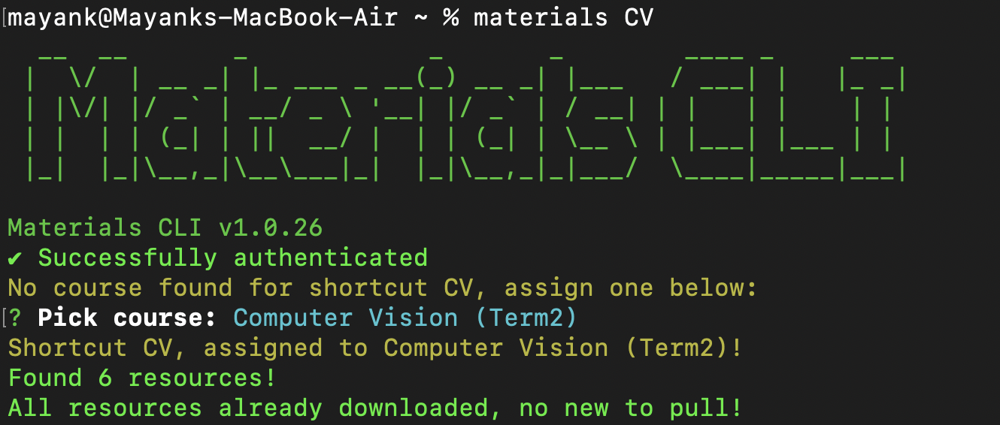
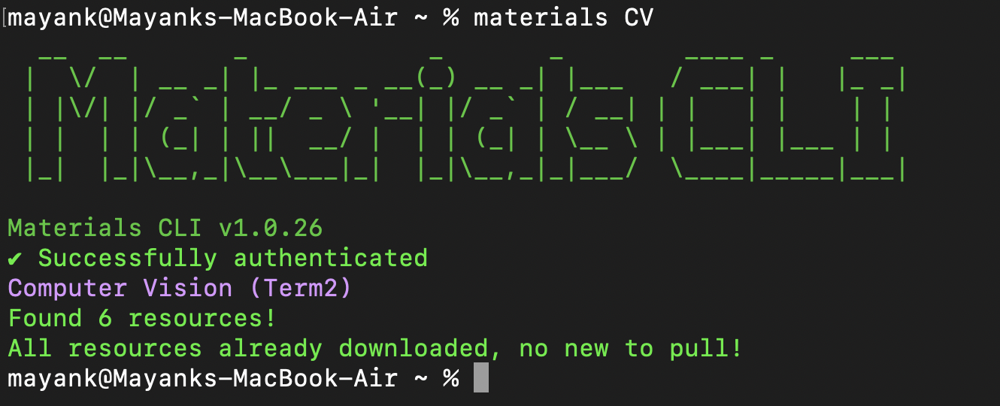

# Materials CLI
 

CLI for Imperial's Department of Computing Materials Page.

Pulls all the latest resources from your course into your folder, pulling only the ones you haven't got in your folder.

Credentials are stored using [keytar](https://www.npmjs.com/package/keytar):

> On macOS the passwords are managed by the Keychain, on Linux they are managed by the Secret Service API/libsecret, and on Windows they are managed by Credential Vault.


### Features
1. Auto download resources for courses from terminal
2. Auto login (after first call) to quickly access resources
3. Only pulls new resources, so you don't need to find which ones are new
4. Shortcuts to quickly access your main courses
5. Concurrent downloads of materials


## Installation

### Prerequisites (Only Linux)

#### Ubuntu

`sudo apt-get install libsecret-1-dev gnome-keyring`

#### Other Linux Distributions

Please check the documentation for [keytar](https://www.npmjs.com/package/keytar) to download them

### Package Installation

`npm install -g materials-cli`


## Usage

Type `materials` in the terminal to access the CLI.

Full options:

```  
usage: materials [-h] [-v] [-c] [-d] [-a] [shortcut]

Materials CLI Tool

positional arguments:
  shortcut       Shortcut to course

optional arguments:
  -h, --help     show this help message and exit
  -v, --version  show program's version number and exit
  -c, --clean    Clean configurations
  -o, --open     Open folder based off shortcut or selection
  -d, --dir      Save folders in current directory instead
  -a, --all      Download all shortcut courses one go

 ```  

### Shortcuts

You can set shortcuts to courses by using the `shortcut` argument. If no shortcut is found, selecting the course will assign  
the shortcut to the chosen course. The next time you run `materials` it will automatically fetch courses for the course chosen before.

Example:

Using `CV` shortcut for first time:



Using `CV` example again:



**You can use -a or --all to download all the courses that have shortcuts in one go**

### Credentials

Credentials are stored in the OS's keychain and retrieved on every call to `materials`.

The credentials are never sent to anywhere other than `https://materials.doc.ic.ac.uk` and `https://api-materials.doc.ic.ac.uk`.

The package [keytar](https://www.npmjs.com/package/keytar) is used for this.

## TODO

Currently, this uses a mix of the current materials page (https://materials.doc.ic.ac.uk) and the new API (https://api-materials.doc.ic.ac.uk).

The new API is slow to fetch resources, and the `/file` endpoint doesn't seem to work so that's why the old version is used for file fetching.

When the new API is ready to serve files, the legacy method should be removed.

1. Remove old API method using session cookies
2. Add fine-grained control of config of credentials and shortcuts
3. Find way to schedule pulling of files in the mornings
4. Test on different Linux distributions
