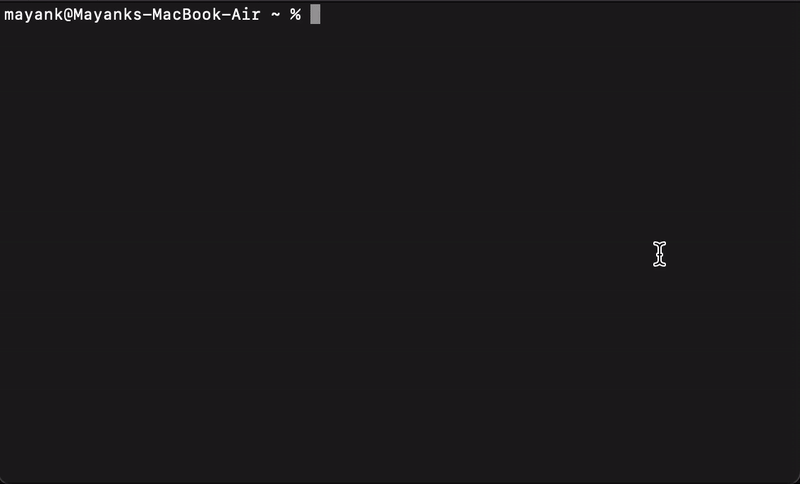

# Materials CLI 

CLI for Imperial's Department of Computing Materials Page.

Pulls all the latest resources from your course into your folder, pulling only the ones you haven't got in your folder.

## Installation

### Ubuntu Prerequisites

`sudo apt-get install libsecret-1-dev gnome-keyring`

### Package Installation

`npm install -g materials-cli`

## Usage

`materials`

### Credentials

Credentials are stored in the OS's keychain and retrieved on every call to `materials`.

The credentials are never sent to anywhere other than `https://materials.doc.ic.ac.uk` and `https://api-materials.doc.ic.ac.uk`.

The package [keytar](https://www.npmjs.com/package/keytar) is used for this. 

### Clear config

To clear configuration just type: `materials clean`

## TODO

Currently, this uses a mix of the current materials page (https://materials.doc.ic.ac.uk) and the new API (https://api-materials.doc.ic.ac.uk).

The new API is slow to fetch resources, and the `/file` endpoint doesn't seem to work so that's why the old version is used for file fetching.

When the new API is ready to serve files, the legacy method should be removed.

1. Remove old API method using session cookies
2. Auto-calculate year (currently hardcoded to `2021`)
3. Add "favourite" courses to pull all latest content from all subscribed courses
4. Find way to schedule pulling of files in the mornings
5. Test on Linux and Windows
